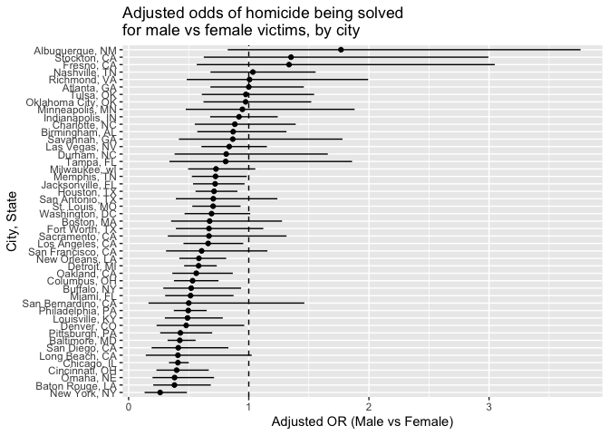
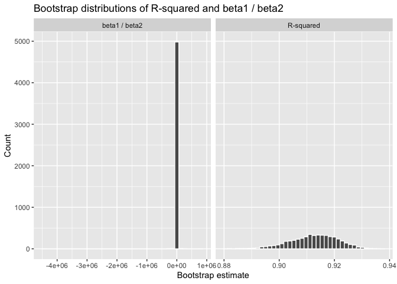
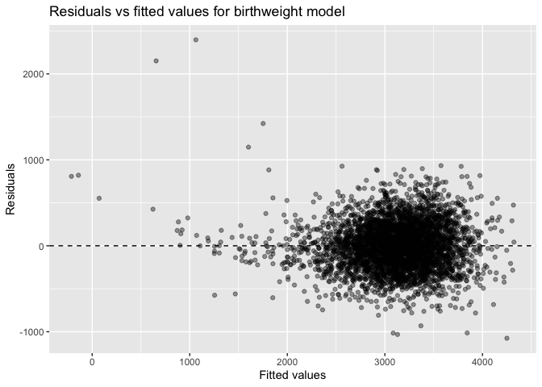
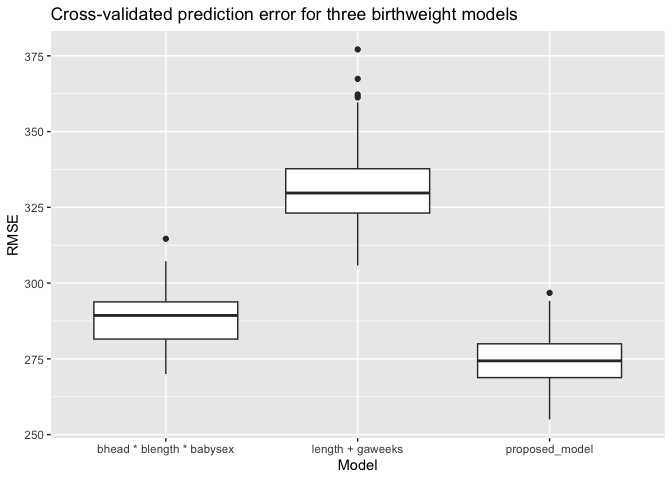

p8105_hw6-km4071
================
Kaicheng Mo
2025-12-01

# Problem 1

``` r
knitr::opts_chunk$set(
  echo = TRUE,
  message = FALSE,
  warning = FALSE
)

library(tidyverse)
```

    ## ── Attaching core tidyverse packages ──────────────────────── tidyverse 2.0.0 ──
    ## ✔ dplyr     1.1.4     ✔ readr     2.1.5
    ## ✔ forcats   1.0.0     ✔ stringr   1.5.1
    ## ✔ ggplot2   3.5.2     ✔ tibble    3.3.0
    ## ✔ lubridate 1.9.4     ✔ tidyr     1.3.1
    ## ✔ purrr     1.1.0     
    ## ── Conflicts ────────────────────────────────────────── tidyverse_conflicts() ──
    ## ✖ dplyr::filter() masks stats::filter()
    ## ✖ dplyr::lag()    masks stats::lag()
    ## ℹ Use the conflicted package (<http://conflicted.r-lib.org/>) to force all conflicts to become errors

``` r
library(broom)
library(purrr)
```

``` r
homicide_df_raw =
  read_csv("homicide-data.csv")

homicide_df =
  homicide_df_raw |>
  mutate(
    city_state  = str_c(city, state, sep = ", "),
    resolved    = as.numeric(disposition == "Closed by arrest"),
    victim_age  = as.numeric(victim_age),
    victim_sex  = factor(victim_sex),
    victim_sex  = fct_relevel(victim_sex, "Female"),
    victim_race = factor(victim_race),
    victim_race = fct_relevel(victim_race, "White")
  ) |>
  filter(
    !(city_state %in% c(
      "Dallas, TX",
      "Phoenix, AZ",
      "Kansas City, MO",
      "Tulsa, AL"
    )),
    victim_race %in% c("White", "Black")
  ) |>
  drop_na(
    resolved,
    victim_age,
    victim_sex,
    victim_race
  )

homicide_df
```

    ## # A tibble: 39,403 × 14
    ##    uid        reported_date victim_last  victim_first victim_race victim_age
    ##    <chr>              <dbl> <chr>        <chr>        <fct>            <dbl>
    ##  1 Alb-000003      20100601 SATTERFIELD  VIVIANA      White               15
    ##  2 Alb-000005      20100102 MULA         VIVIAN       White               72
    ##  3 Alb-000006      20100126 BOOK         GERALDINE    White               91
    ##  4 Alb-000009      20100130 MARTIN-LEYVA GUSTAVO      White               56
    ##  5 Alb-000016      20100308 GRAY         STEFANIA     White               43
    ##  6 Alb-000018      20100323 DAVID        LARRY        White               52
    ##  7 Alb-000019      20100402 BRITO        ELIZABETH    White               22
    ##  8 Alb-000021      20100423 KING         TEVION       Black               15
    ##  9 Alb-000022      20100423 BOYKIN       CEDRIC       Black               25
    ## 10 Alb-000023      20100518 BARRAGAN     MIGUEL       White               20
    ## # ℹ 39,393 more rows
    ## # ℹ 8 more variables: victim_sex <fct>, city <chr>, state <chr>, lat <dbl>,
    ## #   lon <dbl>, disposition <chr>, city_state <chr>, resolved <dbl>

``` r
baltimore_df =
  homicide_df |>
  filter(city_state == "Baltimore, MD")

baltimore_fit =
  glm(
    resolved ~ victim_age + victim_sex + victim_race,
    data   = baltimore_df,
    family = binomial()
  )

baltimore_tidy =
  baltimore_fit |>
  tidy(conf.int = TRUE, exponentiate = TRUE)

baltimore_or =
  baltimore_tidy |>
  filter(term == "victim_sexMale") |>
  select(term, estimate, conf.low, conf.high)

baltimore_or
```

    ## # A tibble: 1 × 4
    ##   term           estimate conf.low conf.high
    ##   <chr>             <dbl>    <dbl>     <dbl>
    ## 1 victim_sexMale    0.426    0.324     0.558

``` r
city_or_results =
  homicide_df |>
  group_by(city_state) |>
  nest() |>
  mutate(
    model = map(
      data,
      ~ glm(
        resolved ~ victim_age + victim_sex + victim_race,
        data   = .x,
        family = binomial()
      )
    ),
    results = map(
      model,
      ~ tidy(.x, conf.int = TRUE, exponentiate = TRUE)
    )
  ) |>
  select(city_state, results) |>
  unnest(results) |>
  filter(term == "victim_sexMale") |>
  select(city_state, estimate, conf.low, conf.high) |>
  ungroup()

city_or_results
```

    ## # A tibble: 47 × 4
    ##    city_state      estimate conf.low conf.high
    ##    <chr>              <dbl>    <dbl>     <dbl>
    ##  1 Albuquerque, NM    1.77     0.825     3.76 
    ##  2 Atlanta, GA        1.00     0.680     1.46 
    ##  3 Baltimore, MD      0.426    0.324     0.558
    ##  4 Baton Rouge, LA    0.381    0.204     0.684
    ##  5 Birmingham, AL     0.870    0.571     1.31 
    ##  6 Boston, MA         0.674    0.353     1.28 
    ##  7 Buffalo, NY        0.521    0.288     0.936
    ##  8 Charlotte, NC      0.884    0.551     1.39 
    ##  9 Chicago, IL        0.410    0.336     0.501
    ## 10 Cincinnati, OH     0.400    0.231     0.667
    ## # ℹ 37 more rows

``` r
city_or_plot_df =
  city_or_results |>
  mutate(
    city_state = fct_reorder(city_state, estimate)
  )

ggplot(city_or_plot_df, aes(x = city_state, y = estimate)) +
  geom_point() +
  geom_errorbar(aes(ymin = conf.low, ymax = conf.high), width = 0) +
  geom_hline(yintercept = 1, linetype = "dashed") +
  coord_flip() +
  labs(
    x     = "City, State",
    y     = "Adjusted OR (Male vs Female)",
    title = "Adjusted odds of homicide being solved\nfor male vs female victims, by city"
  )
```

<!-- -->

This figure shows substantial variation across cities in the adjusted
odds that a homicide involving a male victim is solved compared with one
involving a female victim. Many cities have odds ratios below 1,
suggesting that cases with male victims are generally less likely to be
cleared after accounting for age and race. A few cities show odds ratios
above 1, although these estimates often have wide confidence intervals
that indicate considerable uncertainty. In most cities the intervals are
broad and frequently cross 1, which limits strong conclusions for any
single location. Overall, the plot suggests a tendency toward lower
clearance rates for male victims, but the strength of this pattern
varies across jurisdictions and is estimated with differing precision.

# Problem 2

``` r
library(modelr)
library(p8105.datasets)

set.seed(1)
```

``` r
data("weather_df")

weather_df =
  weather_df |>
  filter(name == "CentralPark_NY") |>
  drop_na(tmax, tmin, prcp)

base_fit =
  lm(tmax ~ tmin + prcp, data = weather_df)

base_fit |>
  glance() |>
  select(r.squared)
```

    ## # A tibble: 1 × 1
    ##   r.squared
    ##       <dbl>
    ## 1     0.912

``` r
base_fit |>
  tidy()
```

    ## # A tibble: 3 × 5
    ##   term        estimate std.error statistic   p.value
    ##   <chr>          <dbl>     <dbl>     <dbl>     <dbl>
    ## 1 (Intercept)  7.56     0.162        46.6  1.31e-220
    ## 2 tmin         1.03     0.0119       86.9  0        
    ## 3 prcp        -0.00157  0.000966     -1.63 1.04e-  1

``` r
n_boot = 5000

boot_straps =
  weather_df |>
  modelr::bootstrap(n = n_boot, id = "strap_id")

boot_results =
  boot_straps |>
  mutate(
    fit    = map(strap, ~ lm(tmax ~ tmin + prcp, data = .x)),
    glance = map(fit, glance),
    tidy   = map(fit, tidy)
  ) |>
  mutate(
    r_sq = map_dbl(glance, "r.squared"),
    beta_ratio = map_dbl(
      tidy,
      ~ {
        coefs =
          .x |>
          select(term, estimate)

        b1 =
          coefs |>
          filter(term == "tmin") |>
          pull(estimate)

        b2 =
          coefs |>
          filter(term == "prcp") |>
          pull(estimate)

        b1 / b2
      }
    )
  ) |>
  select(strap_id, r_sq, beta_ratio)
```

``` r
boot_long =
  boot_results |>
  pivot_longer(
    cols      = c(r_sq, beta_ratio),
    names_to  = "stat",
    values_to = "value"
  ) |>
  mutate(
    stat = recode(
      stat,
      r_sq       = "R-squared",
      beta_ratio = "beta1 / beta2"
    )
  )

ggplot(boot_long, aes(x = value)) +
  geom_histogram(bins = 40, color = "white") +
  facet_wrap(~ stat, scales = "free_x") +
  labs(
    x     = "Bootstrap estimate",
    y     = "Count",
    title = "Bootstrap distributions of R-squared and beta1 / beta2"
  )
```

<!-- --> The
bootstrap distribution for R^2 appears stable and well-behaved, but the
distribution of β1/β2is extremely distorted. This occurs because the
precipitation coefficient β2 is very close to zero in many bootstrap
samples, causing the ratio β1/β2 to explode to very large positive or
negative values. As a result, the histogram is dominated by extreme
outliers and collapses visually into a single vertical bar. This
indicates that the ratio is not a numerically stable or meaningful
summary for these data, even though the bootstrap procedure itself is
functioning correctly.

``` r
ci_r_sq =
  boot_results |>
  summarise(
    lower = quantile(r_sq, 0.025),
    upper = quantile(r_sq, 0.975)
  ) |>
  mutate(stat = "R-squared")

ci_beta_ratio =
  boot_results |>
  summarise(
    lower = quantile(beta_ratio, 0.025),
    upper = quantile(beta_ratio, 0.975)
  ) |>
  mutate(stat = "beta1 / beta2")

ci_table =
  bind_rows(ci_r_sq, ci_beta_ratio) |>
  relocate(stat)

ci_table
```

    ## # A tibble: 2 × 3
    ##   stat              lower    upper
    ##   <chr>             <dbl>    <dbl>
    ## 1 R-squared         0.894    0.928
    ## 2 beta1 / beta2 -5616.    4587.

The bootstrap confidence interval for R^2 is narrow and well-defined,
reflecting a stable relationship between the predictors and maximum
temperature. In contrast, the confidence interval for β1/β2 is extremely
wide, spanning from roughly –5600 to 4600. This occurs because the
precipitation coefficient β2 is frequently very close to zero across
bootstrap samples, causing the ratio to become highly unstable and
producing extreme values. As a result, the ratio is not a reliable or
interpretable summary for these data, even though the bootstrap
procedure itself is functioning correctly.

\#Problem 3

``` r
birthweight_df =
  read_csv("birthweight.csv") |>
  mutate(
    babysex = factor(
      babysex,
      levels = c(1, 2),
      labels = c("male", "female")
    ),
    frace = factor(
      frace,
      levels = c(1, 2, 3, 4, 8, 9),
      labels = c("White", "Black", "Asian", "Puerto Rican", "Other", "Unknown")
    ),
    mrace = factor(
      mrace,
      levels = c(1, 2, 3, 4, 8),
      labels = c("White", "Black", "Asian", "Puerto Rican", "Other")
    ),
    malform = factor(
      malform,
      levels = c(0, 1),
      labels = c("absent", "present")
    )
  )
```

``` r
birthweight_df |>
  summarise(across(everything(), ~ sum(is.na(.))))
```

    ## # A tibble: 1 × 20
    ##   babysex bhead blength   bwt delwt fincome frace gaweeks malform menarche
    ##     <int> <int>   <int> <int> <int>   <int> <int>   <int>   <int>    <int>
    ## 1       0     0       0     0     0       0     0       0       0        0
    ## # ℹ 10 more variables: mheight <int>, momage <int>, mrace <int>, parity <int>,
    ## #   pnumlbw <int>, pnumsga <int>, ppbmi <int>, ppwt <int>, smoken <int>,
    ## #   wtgain <int>

``` r
bw_model =
  lm(
    bwt ~ babysex + bhead + blength + gaweeks +
      ppbmi + smoken + wtgain + momage + mrace,
    data = birthweight_df
  )

summary(bw_model)
```

    ## 
    ## Call:
    ## lm(formula = bwt ~ babysex + bhead + blength + gaweeks + ppbmi + 
    ##     smoken + wtgain + momage + mrace, data = birthweight_df)
    ## 
    ## Residuals:
    ##      Min       1Q   Median       3Q      Max 
    ## -1075.58  -186.53    -4.51   177.81  2396.14 
    ## 
    ## Coefficients:
    ##                     Estimate Std. Error t value Pr(>|t|)    
    ## (Intercept)       -5776.9052   102.7701 -56.212  < 2e-16 ***
    ## babysexfemale        31.9763     8.5071   3.759 0.000173 ***
    ## bhead               132.0940     3.4664  38.106  < 2e-16 ***
    ## blength              76.4761     2.0193  37.872  < 2e-16 ***
    ## gaweeks              11.0829     1.4691   7.544 5.52e-14 ***
    ## ppbmi                 6.8413     1.3445   5.088 3.76e-07 ***
    ## smoken               -4.6227     0.5886  -7.854 5.04e-15 ***
    ## wtgain                4.1554     0.3965  10.481  < 2e-16 ***
    ## momage                1.9746     1.1705   1.687 0.091689 .  
    ## mraceBlack         -142.5266     9.8060 -14.535  < 2e-16 ***
    ## mraceAsian         -104.7026    42.7859  -2.447 0.014439 *  
    ## mracePuerto Rican  -134.9229    18.8711  -7.150 1.02e-12 ***
    ## ---
    ## Signif. codes:  0 '***' 0.001 '**' 0.01 '*' 0.05 '.' 0.1 ' ' 1
    ## 
    ## Residual standard error: 274.3 on 4330 degrees of freedom
    ## Multiple R-squared:  0.7139, Adjusted R-squared:  0.7132 
    ## F-statistic: 982.4 on 11 and 4330 DF,  p-value: < 2.2e-16

``` r
birthweight_df |>
  add_predictions(bw_model) |>
  add_residuals(bw_model) |>
  ggplot(aes(x = pred, y = resid)) +
  geom_point(alpha = 0.4) +
  geom_hline(yintercept = 0, linetype = "dashed") +
  labs(
    x = "Fitted values",
    y = "Residuals",
    title = "Residuals vs fitted values for birthweight model"
  )
```

<!-- -->

``` r
set.seed(1)

cv_df =
  crossv_mc(
    birthweight_df,
    n = 100,
    test = 0.2
  )
```

``` r
cv_df =
  cv_df |>
  mutate(
    mod_my = map(
      train,
      ~ lm(
        bwt ~ babysex + bhead + blength + gaweeks +
          ppbmi + smoken + wtgain + momage + mrace,
        data = .x
      )
    ),
    mod_len_gae = map(
      train,
      ~ lm(
        bwt ~ blength + gaweeks,
        data = .x
      )
    ),
    mod_head_len_sex = map(
      train,
      ~ lm(
        bwt ~ bhead * blength * babysex,
        data = .x
      )
    )
  ) |>
  mutate(
    rmse_my = map2_dbl(mod_my, test, ~ rmse(model = .x, data = .y)),
    rmse_len_gae = map2_dbl(mod_len_gae, test, ~ rmse(model = .x, data = .y)),
    rmse_head_len_sex = map2_dbl(mod_head_len_sex, test, ~ rmse(model = .x, data = .y))
  )
```

``` r
cv_rmse_long =
  cv_df |>
  select(rmse_my, rmse_len_gae, rmse_head_len_sex) |>
  pivot_longer(
    everything(),
    names_to = "model",
    values_to = "rmse"
  ) |>
  mutate(
    model = recode(
      model,
      rmse_my = "proposed_model",
      rmse_len_gae = "length + gaweeks",
      rmse_head_len_sex = "bhead * blength * babysex"
    )
  )
```

``` r
cv_rmse_long |>
  ggplot(aes(x = model, y = rmse)) +
  geom_boxplot() +
  labs(
    x = "Model",
    y = "RMSE",
    title = "Cross-validated prediction error for three birthweight models"
  )
```

<!-- -->

``` r
cv_rmse_long |>
  group_by(model) |>
  summarise(
    mean_rmse = mean(rmse),
    sd_rmse = sd(rmse)
  )
```

    ## # A tibble: 3 × 3
    ##   model                     mean_rmse sd_rmse
    ##   <chr>                         <dbl>   <dbl>
    ## 1 bhead * blength * babysex      289.    9.22
    ## 2 length + gaweeks               332.   14.0 
    ## 3 proposed_model                 275.    7.96

The residuals are centered around zero but show non-constant variance,
with greater spread at higher fitted birthweights. This pattern suggests
mild heteroscedasticity and indicates that the model does not fully
capture variability across the birthweight range, although no strong
nonlinear structure is evident.

The proposed model has the lowest mean RMSE, indicating the best
predictive performance among the three. The interaction-heavy model
performs moderately well but is less accurate than the proposed model,
while the simple length + gaweeks model has the highest prediction
error. Overall, including multiple maternal and infant characteristics
improves prediction accuracy.
